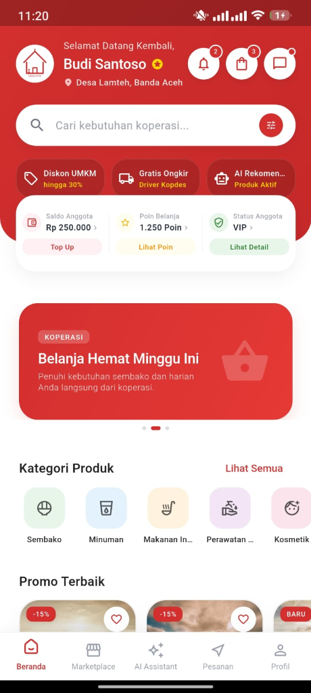
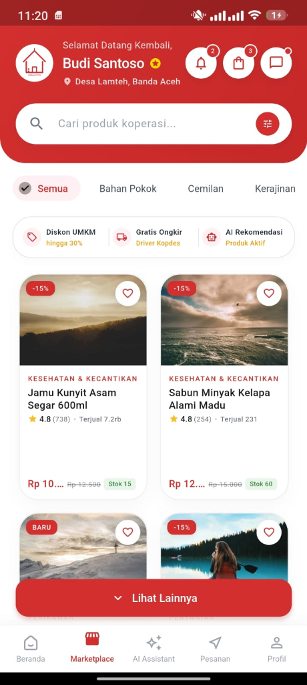
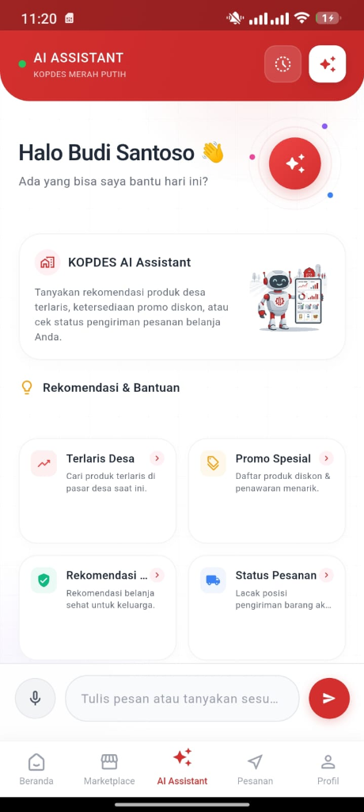
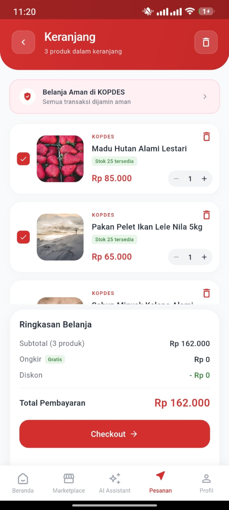
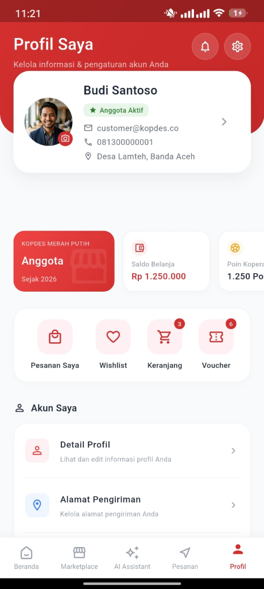

# KOPDES: Smart Cooperative Intelligence System

KOPDES adalah ekosistem digital koperasi desa terintegrasi berbasis Kecerdasan Buatan (AI) yang dirancang untuk memodernisasi tata kelola koperasi, memfasilitasi transaksi jual-beli produk pelaku usaha mikro (UMKM), menyederhanakan logistik pedesaan, serta mendukung pengambilan keputusan pengadaan barang berbasis data.

---

## 1. Tujuan Pengembangan Aplikasi
* **Digitalisasi & Transparansi Koperasi**: Menggantikan sistem pembukuan manual menjadi administrasi digital real-time untuk mencegah penyelewengan dan kesalahan pencatatan.
* **Pemberdayaan Ekonomi Lokal**: Menyediakan marketplace lokal terstruktur bagi pelaku UMKM desa agar dapat memasarkan produk langsung ke warga sekitar.
* **Manajemen Logistik yang Andal**: Mengatasi keraguan pengiriman barang dengan sistem pelacakan kurir real-time dan pencatatan audit log logistik yang akurat.
* **Efisiensi Rantai Pasok Berbasis AI**: Membantu pengelola koperasi meramalkan kebutuhan pasar di masa mendatang (Demand Forecasting) dan mendeteksi selisih stok (Stock Anomaly Detection) menggunakan machine learning untuk menekan pemborosan.

---

## 2. Daftar Fitur Utama
1. **Multi-Role Workspace (5 Peran)**: Workspace dinamis yang menyesuaikan hak akses berdasarkan peran pengguna (Masyarakat/Customer, Seller/UMKM, Kurir Koperasi, Admin Koperasi, dan Super Admin).
2. **Katalog & Marketplace UMKM**: Modul e-commerce lokal yang mendukung pre-order barang, pencarian semantik (Semantic Search) dengan toleransi salah ketik (*typo*), serta ulasan produk.
3. **Dual Validation Delivery System**: Kurir melihat rute optimal pengantaran di peta interaktif, sementara sistem mencatat titik koordinat GPS dari kurir (saat mengantar) dan customer (saat menerima) sebagai bukti autentik.
4. **AI Conversational Assistants**:
   * *AI Cooperative Assistant (Customer)*: Asisten virtual 24/7 untuk menjawab ketersediaan stok produk koperasi, status pelacakan pesanan, dan promo keanggotaan.
   * *AI UMKM Business Assistant (Seller)*: Analitik bisnis instan untuk menganalisis barang *fast-moving* serta memberikan rekomendasi restock dan promosi produk UMKM.
5. **AI Inventory & Predictive Analytics**:
   * *Demand Forecasting*: Prediksi tren penjualan bulanan menggunakan model **XGBoost**.
   * *Stock Anomaly Detection*: Deteksi otomatis jika terjadi perbedaan antara stok fisik dengan data sistem untuk meminimalisir pencurian atau kerusakan barang.
6. **Usulan Komunitas (Community Suggestion)**: Ruang bagi warga untuk mengajukan produk yang belum tersedia di koperasi, didukung sistem *upvote* anggota yang dianalisis oleh AI sebagai acuan pengadaan inventaris baru.

---

## 3. Teknologi, Framework, Library, & Komponen

### Frontend (Mobile & Desktop App)
* **Framework Utama**: Flutter (Dart)
* **Arsitektur**: Clean Architecture (Data, Domain, Presentation Layers)
* **State Management**: Flutter Riverpod
* **Peta & Tracking**: Flutter Map (OpenStreetMap) & Geolocator
* **Penyimpanan Lokal (Cache Luring)**: Isar Database
* **HTTP Client**: Dio dengan Interceptors untuk otentikasi JWT otomatis

### Backend (Server API)
* **Framework Utama**: NestJS (TypeScript)
* **Database Interface**: Prisma ORM
* **Deployment**: Serverless on Vercel
* **Otentikasi**: JWT (JSON Web Tokens) dengan Role-Based Guard

### Artificial Intelligence & Data Engine
* **AI Agent Orchestration**: LangChain & LangGraph
* **LLM Engine**: Gemini 2.5 Flash API (Google AI) / GPT API
* **Vector Database**: Qdrant (Penyimpanan Vector Embeddings untuk RAG)
* **Machine Learning**: XGBoost (Demand Forecasting) & IndoBERT (klasifikasi usulan)
* **Object Storage**: MinIO S3 (Penyimpanan Gambar Produk)
* **Caching & Session**: Valkey / Redis

---

## 4. Struktur Database (Schema Prisma)
Database relasional menggunakan PostgreSQL dengan skema tabel utama sebagai berikut:

* **Otentikasi & Akun**:
  * `User`: Data kredensial pengguna, no. telepon, nama, dan jenis `Role` (SUPER_ADMIN, ADMIN_KOPDES, CUSTOMER, UMKM, COURIER).
  * `RefreshToken`: Token penyegar sesi otentikasi JWT pengguna.
  * `Address`: Daftar alamat pengiriman yang terikat pada masing-masing akun pengguna.
* **Katalog Produk & Penjual**:
  * `UMKM`: Profil UMKM lokal yang terdaftar, status verifikasi, dan deskripsi usaha.
  * `Category`: Kategori pengelompokan produk.
  * `Product`: Stok barang fisik milik Koperasi KOPDES.
  * `UMKMProduct`: Katalog produk yang diproduksi dan dijual oleh UMKM lokal.
  * `ProductImage`: URL gambar dan foto produk (koperasi & UMKM).
* **Transaksi & Belanja**:
  * `Cart` & `CartItem`: Penampung barang belanjaan sementara milik pengguna.
  * `Order` & `OrderItem`: Pencatatan transaksi checkout, rincian barang dibeli, total harga, status order, dan alamat tujuan.
  * `Payment` & `Invoice`: Pencatatan jenis pembayaran (QRIS/COD), status pembayaran, nominal, dan nomor invoice.
* **Logistik**:
  * `Delivery`: Penugasan kurir, status logistik, dan waktu estimasi tiba.
  * `DeliveryLocation`: Rekaman koordinat GPS historis perjalanan kurir saat proses pengantaran berlangsung.
* **Umpan Balik & Interaksi Sosial**:
  * `Review`: Rating dan komentar dari pembeli untuk evaluasi kualitas produk.
  * `CommunitySuggestion` & `CommunitySuggestionSupport`: Usulan pengadaan barang baru dari warga serta dukungan voting dari warga desa lainnya.
* **Audit & Operasional**:
  * `InventoryTransaction`: Log riwayat mutasi barang masuk, keluar, atau penyesuaian stok.
  * `AuditLog`: Log aktivitas penting pada sistem untuk menjaga keamanan data.

---

## 5. Panduan Instalasi & Menjalankan Aplikasi

### A. Persiapan Backend (NestJS Server)
1. Buka folder backend:
   ```bash
   cd backend
   ```
2. Pasang modul dependensi:
   ```bash
   npm install
   ```
3. Buat file `.env` berdasarkan template `.env.example`, lalu sesuaikan variabel konfigurasi (Database URL, Redis Host, Gemini API Key, JWT Secret, dll).
4. Jalankan migrasi database Prisma untuk membentuk struktur tabel PostgreSQL:
   ```bash
   npx prisma migrate dev
   ```
5. Jalankan server backend dalam mode pengembangan:
   ```bash
   npm run start:dev
   ```

### B. Persiapan Frontend (Flutter App)
1. Pastikan Anda berada di direktori root proyek KOPDES.
2. Pasang packages dependensi Flutter:
   ```bash
   flutter pub get
   ```
3. Konfigurasi alamat IP Backend Vercel atau Server Lokal pada file `lib/core/config/api_config.dart`.
4. Jalankan aplikasi di perangkat emulator atau ponsel fisik yang terhubung:
   ```bash
   flutter run
   ```
5. Untuk membangun file distribusi APK:
   ```bash
   flutter build apk --debug
   ```

---

## 6. Screenshot Tampilan Aplikasi

Berikut adalah dokumentasi antarmuka pengguna aplikasi KOPDES (Masyarakat/Customer):

| Beranda KOPDES | Marketplace UMKM | AI Assistant Pintar |
| :---: | :---: | :---: |
|  |  |  |

| Keranjang Belanja | Profil Pengguna |
| :---: | :---: |
|  |  |
