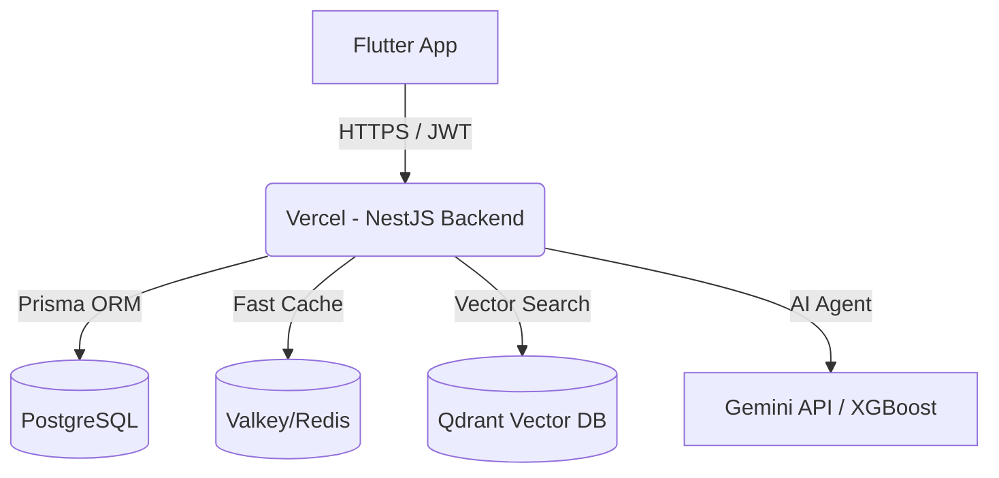

# Pembahasan Slide Presentasi KOPDES (Smart Cooperative Intelligence System)

Dokumen ini berisi materi detail untuk 8 slide presentasi proyek KOPDES. Format pembahasan dirancang agar memudahkan presenter dalam membawakan materi, dilengkapi dengan poin utama slide (*Slide Content*) dan catatan untuk pembicara (*Speaker Notes*).

---

## Slide 1: Latar Belakang

### **Konten Slide (Slide Content)**
* **Transformasi Sektor Rural**: Urgensi digitalisasi di daerah pedesaan guna meningkatkan kemandirian ekonomi.
* **Koperasi sebagai Pilar Utama**: Koperasi desa memiliki potensi ekonomi yang besar tetapi operasionalnya masih konvensional.
* **Pemberdayaan UMKM Lokal**: Pentingnya memberikan wadah digital bagi pelaku usaha desa untuk memperluas jangkauan pasar.
* **KOPDES**: Solusi ekosistem digital terintegrasi yang menghubungkan koperasi, pelaku usaha, dan masyarakat melalui teknologi modern dan Kecerdasan Buatan (AI).

### **Catatan Pembicara (Speaker Notes)**
> "Selamat pagi/siang rekan-rekan. Hari ini saya ingin mempresentasikan KOPDES, sebuah platform inovatif untuk mendigitalisasi Koperasi Desa. Selama ini kita melihat digitalisasi berfokus di perkotaan, padahal ekonomi pedesaan memiliki potensi luar biasa. Koperasi desa sering kali menjadi tulang punggung ekonomi warga, namun operasionalnya masih tertinggal. KOPDES hadir sebagai solusi terpadu untuk menjembatani koperasi konvensional menuju era digital cerdas."

---

## Slide 2: Permasalahan yang Diselesaikan

### **Konten Slide (Slide Content)**
1. **Pencatatan Manual & Tidak Efisien**: Risiko kesalahan input data stok, inventaris fisik, dan pencatatan transaksi keuangan.
2. **Keterbatasan Akses Pasar UMKM**: Pelaku usaha lokal kesulitan mempromosikan produk secara luas dan terstruktur.
3. **Logistik & Pengiriman Tidak Transparan**: Tidak adanya pelacakan kurir secara real-time, menyebabkan ketidakpastian pengantaran barang belanjaan.
4. **Keputusan Pengadaan (Procurement) Subjektif**: Pembelian stok barang koperasi hanya didasarkan pada intuisi pengelola, bukan analisis kebutuhan riil warga, memicu penumpukan barang tak laku (*dead stock*) atau kekurangan pasokan barang penting.

### **Catatan Pembicara (Speaker Notes)**
> "Ada empat masalah mendasar yang kami temukan di lapangan. Pertama, operasional manual yang melelahkan dan rentan kesalahan. Kedua, UMKM desa sulit bersaing karena tidak punya pasar digital lokal yang rapi. Ketiga, rantai logistik pengiriman barang belanjaan warga sering bermasalah karena status pengiriman yang tidak transparan. Terakhir, koperasi sering merugi karena salah membeli stok barang (terlalu banyak barang tidak laku atau justru kehabisan stok barang yang paling dicari). Masalah-masalah inilah yang diselesaikan oleh KOPDES secara sistematis."

---

## Slide 3: Tujuan Aplikasi

### **Konten Slide (Slide Content)**
* **Modernisasi Koperasi**: Mengubah operasional koperasi desa menjadi serba digital, otomatis, transparan, dan terukur.
* **Ekosistem UMKM Mandiri**: Menyediakan pasar digital (*local marketplace*) yang mempertemukan penjual lokal langsung dengan konsumen desa.
* **Pengambilan Keputusan Berbasis Data (Data-Driven)**: Membantu pengelola koperasi menyusun perencanaan inventaris yang akurat menggunakan analisis prediktif AI.
* **Kepercayaan & Keandalan Logistik**: Memastikan setiap pengiriman barang tercatat dan terverifikasi secara valid demi kenyamanan warga.

### **Catatan Pembicara (Speaker Notes)**
> "Tujuan utama KOPDES bukan sekadar membuat aplikasi belanja, melainkan membangun ekosistem ekonomi desa yang mandiri. Kami ingin memodernisasi koperasi agar administrasinya transparan, membantu UMKM desa naik kelas dengan memiliki toko digital sendiri, meminimalkan kerugian koperasi melalui keputusan berbasis data, dan menghadirkan layanan logistik pengiriman lokal yang andal demi kepuasan warga desa."

---

## Slide 4: Fitur Utama

### **Konten Slide (Slide Content)**
1. **Multi-Role Workspace (5 Peran)**: Ruang kerja terintegrasi untuk Customer (Masyarakat), Seller (UMKM), Kurir, Admin Koperasi, dan Super Admin.
2. **Dual Validation Delivery System**: Sistem logistik dengan pelacakan kurir real-time menggunakan peta interaktif dan pencatatan koordinat GPS (*Audit Trail*) saat barang diserahkan dan diterima.
3. **Smart Semantic Search**: Fitur pencarian produk pintar yang memahami maksud pencarian pembeli meskipun terdapat kesalahan ketik (*typo*).
4. **AI Conversational Assistants**:
   * *AI Cooperative Assistant*: Membantu customer melacak pesanan dan mengecek ketersediaan stok 24/7.
   * *AI UMKM Business Assistant*: Memberikan analisis penjualan dan rekomendasi bisnis untuk pelaku UMKM.
5. **Predictive Inventory**: Peramalan tren penjualan bulanan (*Demand Forecasting*) dan deteksi otomatis anomali stok fisik.

### **Catatan Pembicara (Speaker Notes)**
> "KOPDES memiliki beberapa fitur unggulan. Sistem ini mendukung lima peran pengguna dengan hak akses yang terenkripsi aman. Salah satu inovasi logistik kami adalah Dual Validation Delivery, di mana pengiriman barang dikonfirmasi secara dua arah oleh kurir dan pelanggan dengan merekam titik koordinat GPS demi menghindari manipulasi status pengiriman. Selain itu, kami menyematkan AI Conversational Assistant untuk mempermudah warga menanyakan stok, serta membantu UMKM menganalisis barang apa yang paling laris dan kapan harus menambah stok."

---

## Slide 5: Teknologi yang Digunakan

### **Konten Slide (Slide Content)**
* **Frontend**: **Flutter (Dart)** - Aplikasi multiplatform (Android/iOS) dengan arsitektur bersih (*Clean Architecture*) dan **Isar Database** untuk penyimpanan data luring (*offline caching*).
* **Backend**: **NestJS (TypeScript)** - Framework server-side modular yang andal, dideploy menggunakan teknologi *serverless* di **Vercel**.
* **Database & ORM**: **PostgreSQL** sebagai penyimpanan relasional utama yang dikelola melalui **Prisma ORM**.
* **Kecerdasan Buatan (AI)**: **LangChain & LangGraph** untuk agen AI, didukung **Gemini API** / **GPT** untuk pemrosesan bahasa alami, serta model **XGBoost** untuk peramalan stok.
* **Storage & Cache**: **Valkey/Redis** untuk manajemen sesi cepat, **Qdrant Vector DB** untuk pencarian semantik (RAG), dan **MinIO S3** untuk penyimpanan gambar produk.

### **Catatan Pembicara (Speaker Notes)**
> "Di balik antarmuka yang ramah pengguna, KOPDES menggunakan teknologi kelas industri. Di sisi frontend, kami menggunakan Flutter dengan Clean Architecture untuk performa maksimal dan kemudahan pemeliharaan kode. Backend kami berbasis NestJS yang dideploy secara serverless di Vercel agar hemat biaya namun memiliki ketahanan tinggi. Kami menggabungkan PostgreSQL untuk data relasional, Qdrant Vector DB untuk memproses ingatan asisten AI, serta algoritma machine learning XGBoost untuk memprediksi stok barang di masa depan."

---

## Slide 6: Arsitektur atau Desain Sistem

### **Konten Slide (Slide Content)**
* **Pola Aliran Data Terintegrasi**:
  1. Pengguna berinteraksi dengan aplikasi Flutter (Frontend).
  2. Permintaan dikirim secara aman menggunakan protokol HTTPS menuju REST API NestJS Backend di Vercel.
  3. Validasi hak akses dilakukan di layer API menggunakan JSON Web Token (JWT) Guard.
  4. Modul Bisnis memproses logika dengan berinteraksi ke PostgreSQL (via Prisma ORM) dan Valkey/Redis (untuk data cepat).
  5. Fitur AI memproses pertanyaan pengguna melalui *Retrieval-Augmented Generation* (RAG) yang menghubungkan database relasional, Qdrant Vector DB, dan Gemini API.

### **Catatan Pembicara (Speaker Notes)**
> "Arsitektur sistem kami didesain sangat modular dan aman. Setiap permintaan dari perangkat Flutter diamankan menggunakan token JWT (JSON Web Token) sehingga data transaksi pelanggan maupun stok UMKM terjamin keamanannya. Selain itu, integrasi AI kami menggunakan metode Retrieval-Augmented Generation atau RAG. Ini memastikan bahwa asisten AI tidak memberikan jawaban berdasarkan tebakan kosong, melainkan berdasarkan data stok riil dan informasi valid yang diambil langsung dari database koperasi melalui Qdrant Vector DB."

---

## Slide 7: Demonstrasi Singkat Aplikasi

### **Skenario Alur Demonstrasi (Demo Flow)**
1. **Registrasi & Login**: Menunjukkan antarmuka pendaftaran akun yang dilengkapi validasi data dan proses masuk yang aman.
2. **Katalog & Pemesanan (Sisi Customer)**: Mencari produk UMKM lokal, memasukkannya ke keranjang belanja, dan melakukan checkout dengan metode COD.
3. **Pengantaran Barang (Sisi Kurir)**: Kurir melihat daftar tugas pengiriman, melacak lokasi customer pada peta terintegrasi, dan melakukan konfirmasi serah terima barang.
4. **Validasi Penerimaan (Sisi Customer)**: Customer memverifikasi kondisi barang belanjaan lalu menekan tombol konfirmasi selesai untuk memperbarui status pesanan.
5. **Analisis Bisnis (Sisi Seller/UMKM)**: Menampilkan halaman dashboard UMKM yang berisi total pendapatan, sisa stok produk, dan rekomendasi bisnis dari AI Assistant.

### **Catatan Pembicara (Speaker Notes)**
> "Mari kita lihat bagaimana aplikasi ini bekerja dalam kehidupan nyata. Kita mulai dengan registrasi customer baru. Setelah masuk, customer bisa menjelajahi berbagai macam produk koperasi dan UMKM terdekat. Mereka bisa langsung melakukan pembelian. Ketika kurir mengantarkan pesanan, kurir akan menekan tombol serah terima di lokasinya. Pelanggan kemudian memverifikasi barang fisiknya dan menekan tombol konfirmasi penerimaan di ponsel mereka. Di akhir hari, pelaku UMKM dapat membuka dashboard mereka untuk memantau grafik penjualan hari itu dan berdiskusi dengan AI Business Assistant mengenai strategi penjualan esok hari."

---

## Slide 8: Kesimpulan

### **Konten Slide (Slide Content)**
* **Digitalisasi Terpadu**: KOPDES sukses mengintegrasikan seluruh aktor ekonomi desa (Koperasi, UMKM, Warga, dan Kurir) dalam satu platform mobile yang modern.
* **Efisiensi & Reduksi Risiko**: Deteksi dini anomali inventaris dan peramalan stok berbasis AI meminimalkan potensi kerugian finansial akibat *dead stock* atau pencurian.
* **Kemudahan Akses**: Warga desa memperoleh kemudahan berbelanja kebutuhan pokok dengan jaminan logistik yang aman.
* **Pondasi Desa Cerdas (Smart Village)**: Menjadi langkah awal yang kokoh bagi kemandirian ekonomi pedesaan berbasis teknologi informasi terapan.

### **Catatan Pembicara (Speaker Notes)**
> "Sebagai kesimpulan, KOPDES membuktikan bahwa teknologi modern seperti Flutter, NestJS, dan Artificial Intelligence tidak hanya milik industri perkotaan besar, melainkan bisa diimplementasikan secara praktis dan membawa dampak besar di pedesaan. Dengan meminimalisir kesalahan manual, membuka pasar baru bagi UMKM, dan memberikan transparansi logistik, KOPDES meletakkan pondasi penting bagi terciptanya Smart Village yang mandiri, produktif, dan berbasis data. Terima kasih atas perhatian rekan-rekan sekalian."
